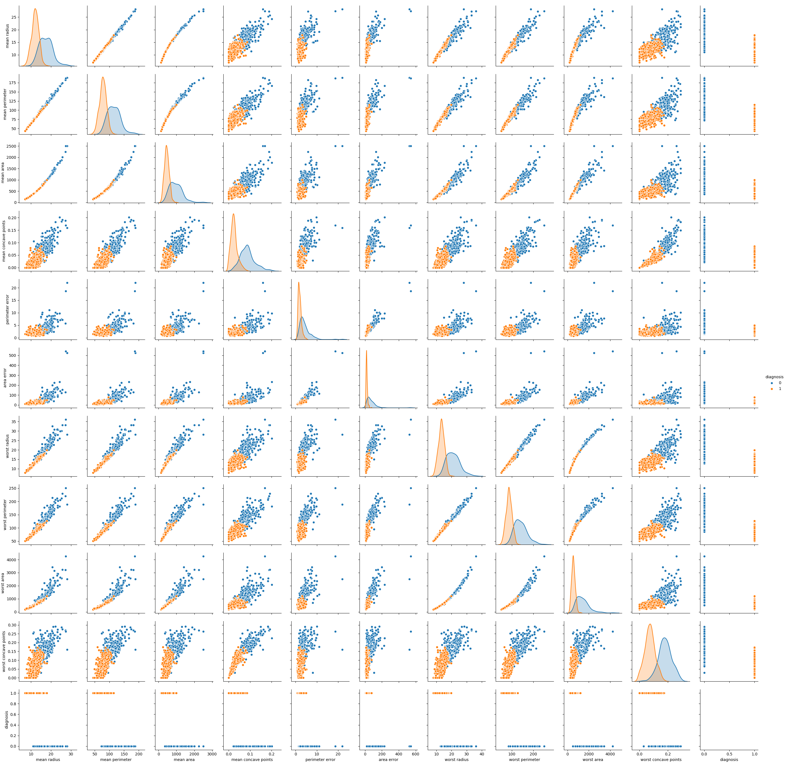
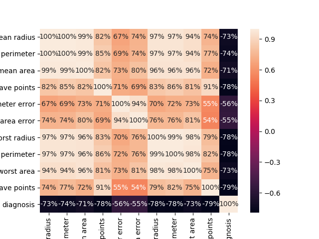
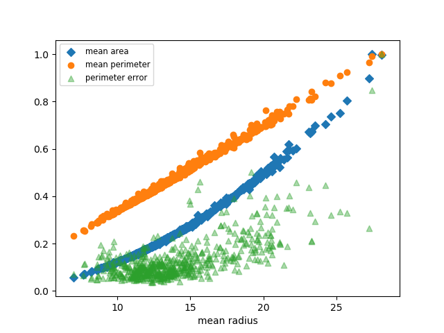

# Homework 8 - Short Report about Visualization of Breast Cancer Wisconsin Dataset

In this short report, Breast Cancer Dataset from sklearn database was investigated. As a first step, effect of
features on the diagnosis (target: Maleign (as 0) or Benign (as 1)) was observed. There are 30 features in this dataset, and 
after plotting each feature against diagnosis, 10 features among them based on their distinctive data distribution against 
diagnosis was selected and presented in Figure 1 below. 20 features were eliminated because their distribution was not clear to identify any region that allow us to differentiate particular diagnosis. 

Figure 1.

As a second step, correlation between these 10 features was analysed, and plotted as a heat map using seaborn in Figure 2. This part is crucial to understand how these features are independent from each other. It is mostly inefficient to use highly correlated features while processing the data. 

Figure 2.

As it seem in Figure 2 that 'mean radius', 'mean perimeter', 'mean area', 'worst radius', 'worst perimeter', and 'worst area' are highly correlated with each other (>90%). It means that we can select one representative feature among them. Such a selection can reduce dimension significantly, and therefore complexity. For instance, two highly correlated features ('mean area' and 'mean perimeter') and one showing average correlation ('perimeter error') with respect to 'mean radius' are plotted and demonstrated in Figure 3. Here, while 'mean area' and 'mean perimeter' are showing almost linear distribution against 'mean radius', 'perimeter error' indicates it as totally different and nonlinear.

Figure 3.

